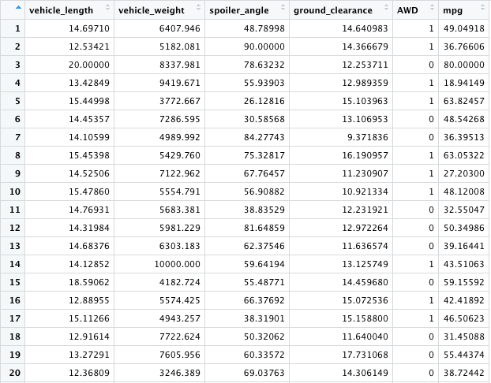
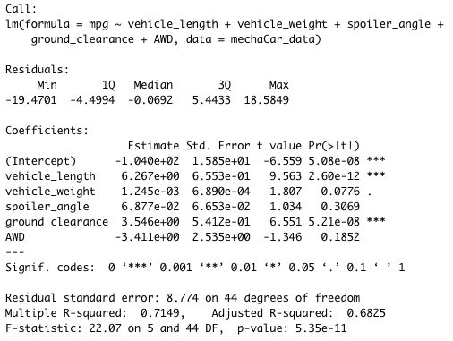
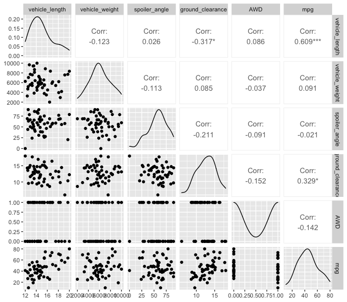
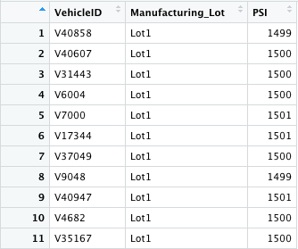
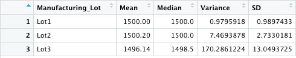
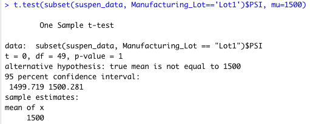
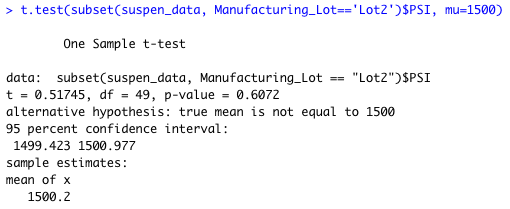
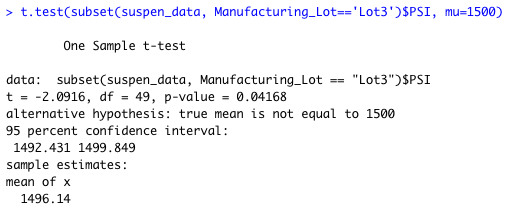

# MechaCar_Statistical_Analysis
Module 15. Bootcamp

## Linear Regression to Predict MPG

### Data

These assumptions are taken to be true.

1. The input data is numerical and continuous.

2. The input data should follow a linear pattern.

3. There is variability in the independent x variable. This means that there must be more than one observation in the x-axis and they must be different values.

4. The residual error (the distance from each data point to the line) should be normally distributed.

### Problem
1. Which variables/coefficients provided a non-random amount of variance to the mpg values in the dataset?

        The Pr(>|t|), of the variables greater than 5%, indicates that these variables have a low level of statistical significance of a regression coefficient.

            - vehicle_weigth
            - spoiler_angle
            - AWD

2. Is the slope of the linear model considered to be zero? Why or why not?

        The p-value of the model is 5.35e-11, which is much lower than the assumed significance level of 0.05%. Therefore, the slope of the model is not zero.

3. Does this linear model predict mpg of MechaCar prototypes effectively? Why or why not?

        Yes, because the model has a multiple R-squared of 0.7149, which tells us that it is 71.49% that this model can be explained by the predictor variables

## Results
### Data analysis results

### Multilinear Regression plot

_________________________

## Summary Statistics on Suspension Coils

### Data

### Problem
The design specifications for the MechaCar suspension coils dictate that the variance of the suspension coils must not exceed 100 pounds per square inch. Does the current manufacturing data meet this design specification for all manufacturing lots in total and each lot individually? Why or why not?

## Results
### Statics analysis
The current manufacturing data meets the design specification if the total data is taken from the three manufacturing lot, with a variance value of 62.29 pounds per square inch.

But this calculation is wrong since it is averaged over 3 manufacturing lot. Two of them comply with the rule and one exceeds the limit with 170.28 pounds per square inch.

### Total summary

### Manifacturing Lot summary

_________________________
## T-Tests on Suspension Coils

### T-test Total

### T-test Lot-1

### T-test Lot-2

### T-test Lot-3

_________________________

## Study Design: MechaCar vs Competition

1. What metric or metrics are you going to test?
2. What is the null hypothesis or alternative hypothesis?
3. What statistical test would you use to test the hypothesis? And why?
4. What data is needed to run the statistical test?
